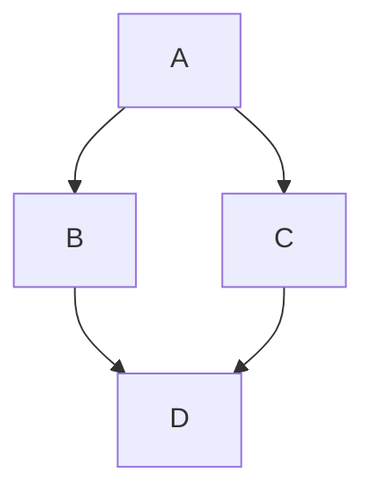

# Kanban Studio Project

This md file provides the required information about the Kanban Studio project and points to other documents as required.


## Overview

The Project is building a Project Management Kanban MVP. The project is built using a Python Server, a Next.js frontend, and a SQLite database. The project also includes an AI chat module based on OpenRouter.

The AI module is a part of the server Python code. The server and the database are running inside a single Docker Container.

The project's scope includes a hardcoded login (`user`/`password`), one Kanban board per user, drag-and-drop cards, editable column titles, AI sidebar that can create/edit/move cards. DB schema supports multi-user for the future.

The project's main technologies are Next.js frontend + Python FastAPI backend +  database (SQLite) + AI chat via OpenRouter. Shipped as one Docker container that serves the static frontend and the API.

## General Agent Instructions

The AI Agent will use the following capabilities:

* For user interaction, use Caveman
* For adding features, use the plugin feature-dev:feature-dev.
* For debugging, use the skill - https://www.skills.sh/obra/superpowers/systematic-debugging.
* For Internet Access and Crawling use Firecrawl + Exa
* For frontend design, use the Frontend Design tool
* For code review, use `docs/ai/code/code_review/code_review_rules.md if it exists, otherwise use the Agent code review best practice.

Agent can suggest a better capability for this section verticals if required add summary of General Agent Instruction when reading this document.

## Architecture

### Hight Level

````

````

### Request Flow
```
Browser → FastAPI (port 8000)
           ├── Static files (Next.js export at /frontend/out/) → served at /
           └── /api/* → FastAPI handlers
                         ├── Session auth (in-memory dict, httpOnly cookie)
                         ├── SQLite (/data/kanban.db, WAL)
                         └── AI calls → OpenRouter
```

- Database

Schema: `users → boards → columns → cards`. `position` column orders columns and cards. Full schema in `project_docs/agents/DATABASE.md`.

## Coding Conventions

### General
- Latest stable libraries, idiomatic patterns.
- Keep it simple — no over-engineering, no unnecessary defensive code, no extra features.
- Be concise. **No emojis ever** (code, UI, or docs).
- For bugs: find root cause with evidence before fixing. Don't guess.

### Files & Naming
- Components: PascalCase (`KanbanCard.tsx`). Lib/util: camelCase (`kanban.ts`).
- Tests beside the file: `foo.test.ts` / `Foo.test.tsx`. E2E in `frontend/tests/`.
- AAA pattern (Arrange, Act, Assert). Test behavior, not implementation.

# Project Tasks

The project tasks are managed in `project_docs/agents/tasks.md`
