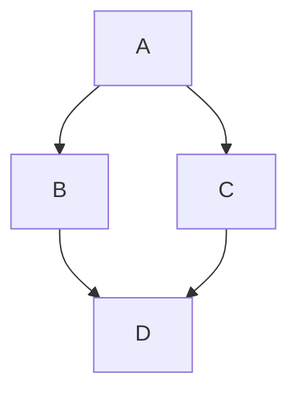

# Kanban Studio — Agent Onboarding

This md file provides the required information about this project and points to other documents as required.

## Overview

The Project is building a Project Management Kanban MVP. The project is built using a Python Server, a Next.js frontend, and a SQLite database. The project also includes an AI chat module based on OpenRouter.

The AI module is a part of the server Python code. The server and the database are running inside a single Docker Container.

**MVP scope:** hardcoded login (`user`/`password`), one Kanban board per user, drag-and-drop cards, editable column titles, AI sidebar that can create/edit/move cards. DB schema supports multi-user for the future.


The main technologies are Next.js frontend + Python FastAPI backend +  database (SQLite) + AI chat via OpenRouter. Shipped as one Docker container that serves the static frontend and the API.


## Architecture


- **Frontend:** 
  - Stack: Next.js 16, React 19, TypeScript (strict), Tailwind CSS 4, `@dnd-kit` (core + sortable)
  - 

## Technology Stack

- **Frontend:** 
  - Stack: Next.js 16, React 19, TypeScript (strict), Tailwind CSS 4, `@dnd-kit` (core + sortable)
  - Testing: Testing Library (frontend unit/component), Playwright (E2E)

- **Backend:** 
  - Stack: FastAPI, Uvicorn, Python 3.13, `uv` package manager, Pydantic
  - DB: SQLite at `/data/kanban.db` (Docker volume `kanban-data`), WAL mode
  - Testing: pytest + httpx TestClient

- **AI:** OpenRouter, model `openai/gpt-oss-120b`, key in root `.env` as `OPENROUTER_API_KEY`

## Commands

### Frontend (`/frontend`)
```bash
npm run dev              # http://localhost:3000
npm run build            # static export to frontend/out/
npm run lint
npm run test             # unit tests
npm run test:unit:watch
npm run test:e2e         # needs dev server
npm run test:all
npx vitest run src/components/KanbanBoard.test.tsx   # single file
```

### Backend (`/backend`)
```bash
uv run uvicorn app.main:app --reload --port 8000
uv run pytest
uv run pytest tests/test_auth.py
uv run pytest -k "test_login"
```

### Docker (full stack)
```bash
./scripts/start.sh                  # build + run at http://localhost:8000
./scripts/stop.sh
bash scripts/integration_test.sh    # test running container
```

## Architecture

### Hight Level

````

````

### Request Flow
```
Browser → FastAPI (port 8000)
           ├── Static files (Next.js export at /frontend/out/) → served at /
           └── /api/* → FastAPI handlers
                         ├── Session auth (in-memory dict, httpOnly cookie)
                         ├── SQLite (/data/kanban.db, WAL)
                         └── AI calls → OpenRouter
```

### Frontend (`/frontend/src`)
- `app/page.tsx` — root: `LoginForm` or `KanbanBoard` based on auth
- `lib/api.ts` — all HTTP to `/api/*`; transforms API ↔ local state
- `lib/kanban.ts` — board types + pure helpers (`moveCard`, `createId`, `findColumnId`, `isColumnId`)
- `components/KanbanBoard.tsx` — owns board state, passes down
- `components/ChatSidebar.tsx` — AI chat; sends history to `/api/ai/chat`, applies returned board updates

Component tree: `KanbanBoard → KanbanColumn → (KanbanCard | NewCardForm)` + `KanbanCardPreview` drag overlay.

Data model (normalized): `Card {id,title,details}`, `Column {id,title,cardIds[]}`, `BoardData {columns[], cards{}}`.

DnD: `DndContext` at board, `SortableContext` per column (vertical), `useDroppable` on columns, `useSortable` on cards, `PointerSensor` with 6px activation.

### Backend (`/backend/app`)
- `main.py` — all FastAPI routes, session store, static mount, lifespan DB init
- `database.py` — all SQLite CRUD, single connection pool; seeds 1 user, 1 board, 5 columns, 8 cards
- `ai.py` — OpenRouter client; injects board state into system prompt; parses board mutations from response

### Database
Schema: `users → boards → columns → cards`. `position` column orders columns and cards. Full schema in `project_docs/agents/DATABASE.md`.

### Auth
Single hardcoded user. Sessions in a Python dict in `main.py`. httpOnly cookie. All `/api/*` except `/api/login` return 401 if unauthenticated.

### AI Integration
`POST /api/ai/chat` with `{ message, conversation_history[] }`. Backend injects current board into system prompt, calls OpenRouter, parses operations (add/move/delete cards, rename columns), applies to SQLite, returns `{ message, board_updates_applied[] }` so the frontend can refresh.

## Coding Conventions

### General
- Latest stable libraries, idiomatic patterns.
- Keep it simple — no over-engineering, no unnecessary defensive code, no extra features.
- Be concise. **No emojis ever** (code, UI, or docs).
- For bugs: find root cause with evidence before fixing. Don't guess.

### Frontend
- TypeScript strict, no `any`. `@/*` path alias → `./src/*`.
- Functional components, arrow functions, one per file. No default exports except pages.
- Props as inline types or `{ComponentName}Props`.
- State via `useState`/`useReducer` in the top container; data/callbacks via props. No external state libs.
- `clsx` for conditional classes. Tailwind utilities + CSS custom properties (`var(--navy-dark)` etc.). No CSS modules / styled-components / inline styles.
- Business logic in `src/lib/`, not components. Keep the normalized data model. IDs via `createId(prefix)`.

### Backend
- Async handlers, type hints everywhere, Pydantic models for request/response.
- Keep routes in `main.py` until complexity demands splitting.
- Tests use a temp SQLite DB via `conftest.py` fixture `setup_test_db`.

### Files & Naming
- Components: PascalCase (`KanbanCard.tsx`). Lib/util: camelCase (`kanban.ts`).
- Tests beside the file: `foo.test.ts` / `Foo.test.tsx`. E2E in `frontend/tests/`.
- AAA pattern (Arrange, Act, Assert). Test behavior, not implementation.

## Frontend Color Scheme

CSS custom properties in `frontend/src/app/globals.css`:
- `--accent-yellow: #ecad0a` — accent lines, highlights
- `--primary-blue: #209dd7` — links, key sections
- `--secondary-purple: #753991` — submit buttons, important actions
- `--navy-dark: #032147` — main headings
- `--gray-text: #888888` — supporting text, labels
- `--surface: #f7f8fb`, `--surface-strong: #fff`, plus `--stroke`, `--shadow`

Fonts: Space Grotesk (display) + Manrope (body) via `next/font/google`.

# Project Tasks

The project tasks are defined in `project_docs/agents/tasks.md`
